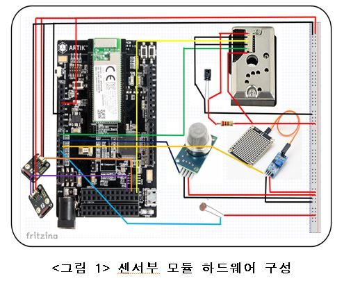
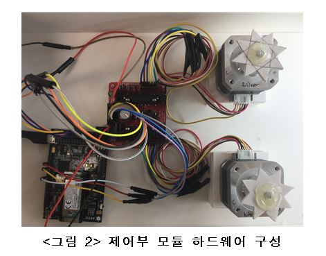
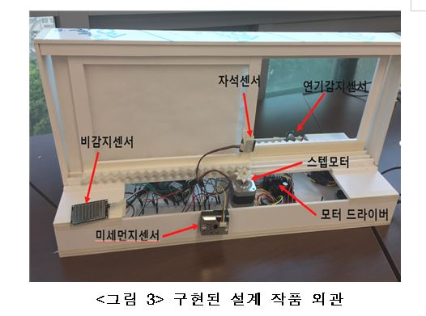
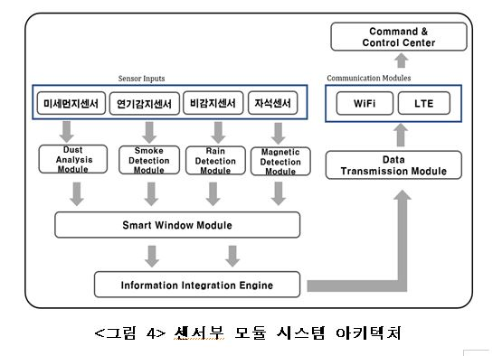
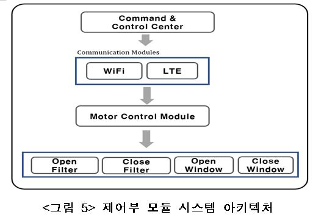
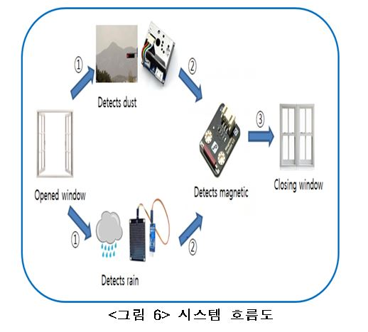
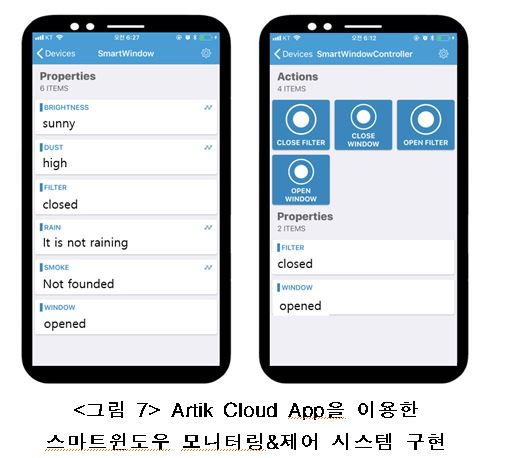

# Design of Smart Window based on IoT using Artik platform #

## 시연 영상 ##
https://drive.google.com/open?id=10igh2-aGt1N39hVb0XHKRXkRKn36mANC

## Hardware Configuration ##

- <그림 1>은 설계한 센서부 모듈 하드웨어 구성이다. 삼성에서 개발한 IoT를 위한 하드웨어 플랫폼인 Artik053을 기반으로 미세먼지센서(GP2Y1010AU0F), 빗물감지센서(SZH-SSBH-022), 마그네틱센서(DFR0033), 연기감지센서(mq2)로 구성하였다.

- <그림 2>는 제어부 하드웨어 구성이다. Artik053을 기반으로 42각 스텝모터(A2K-M243)와 스텝모터를 제어하기 위한 모터 드라이버(MAI-L297-26M)를 연결하여 구성하였다. 

- <그림 3>은 구현한 설계 작품의 외관을 나타낸다. 창문 바깥쪽에는 비감지센서와 미세먼지센서를 부착하여 비가 내리는지 아닌지에 대한 여부 판단과 미세먼지농도를 측정한다. 창문 안쪽에는 연기감지센서를 이용하여 실내에 연기가 많이 생겼거나 화재 발생 시 창문을 자동으로 열어 환기되도록 구현하였다.

## System Architecture ##

- <그림 4>는 센서부 모듈 시스템 아키텍처이다. 설계된 센서부 모듈은 미세먼지센서, 연기감지센서, 비감지센서, 자석센서에서 측정된 데이터를 WiFi, LTE통신을 통하여 Command & Control Center로 전송한다. 
- 전송된 데이터는 Command & Control Center에서 실시간으로 설계된 스마트 윈도우의 센서 데이터를 모니터링 한다. 
- 본 설계작품은 Artik Cloud를 통하여 Command & Control Center를 구성하였다. Artik Cloud는 IoT Device 간의 상호운용성을 가속화하고 새로운 데이터 통찰력을 가능하도록 설계된 개방형 데이터교환 플랫폼이다.

- <그림 5>는 제어부 모듈 시스템 아키텍처이다. 제어부는 WiFi, LTE통신을 통하여 Command & Control Center에서 받은 명령의 작업을 수행한다. 제어부의 명령은 OnpenFilter, CloseFilter, OpneWindow, CloseWindow로 구성되어 있으며 **OpenFilter**는 미세먼지필터의 열림, **CloseFilter**는 미세먼지필터의 닫힘, **OpneWindow**는 창문의 열림, **CloseWindow**는 창문의 닫힘을 의미한다.

## 시스템 흐름도 ##
- <그림 6>은 시스템의 흐름도이다. 창문이 열렸을 경우 센서들을 이용하여 제어한다. 외부의 미세먼지 농도가 높을 경우 미세먼지 필터를 닫거나 창문을 닫고, 비가 올 경우 창문을 닫는다. 
 창의 바깥쪽에 달린 미세먼지 센서가 외부의 농도를 측정한다. 측정값을 좋고 나쁨으로 구분할 때 나쁨이면 모터를 동작시켜 미세먼지 필터를 닫고 창문을 닫는다. 창문을 닫을 때 자석 센서를 동작시켜 창문의 닫힘을 확인하고 사용자에게 창문이 닫혔다는 메시지를 보내준다. 또 빗물감지 센서로는 외부에 비가 오는지 안 오는지를 측정한다. 빗물의 양에 따라 ‘비가 오지 않는다.’, ‘비가 온다.’, ‘비가 많이 온다.’ 로 구분하여 비가 오지 않는 경우를 제외한 나머지 경우에 모터를 동작시켜 창문을 닫고 이 또한 자석센서를 이용해 확인 후 창문이 닫혔다는 메시지를 보내준다.
 

## Artik Cloud를 통한 원격제어  ##

 <그림 7>은 Artik Cloud App을 이용한 스마트윈도우 모니터링&제어 시스템을 구현을 나타낸다. 
 왼쪽의 App 화면에서는 빛, 먼지, 빗물, 연기 센서들을 통해 측정한 값과 미세먼지필터와 창문의 열림/닫힘 상태를 확인할 수 있다. ‘Brightness’는 조도 센서의 측정으로 날씨가 맑고 흐림 정도를 알 수 있고, ‘Dust’는 미세먼지 센서의 측정으로 미세먼지 농도를 3단계로 나누어 확인할 수 있는 등 외부의 상황을 사용자가 알 수 있도록 구현하였다.
 오른쪽의 App 화면에서는 ‘close filter’, ‘close window’, ‘open filter’, ‘open window’ 버튼을 이용하여 필터와 창문의 열고 닫음을 제어할 수 있도록 구현하였다.

